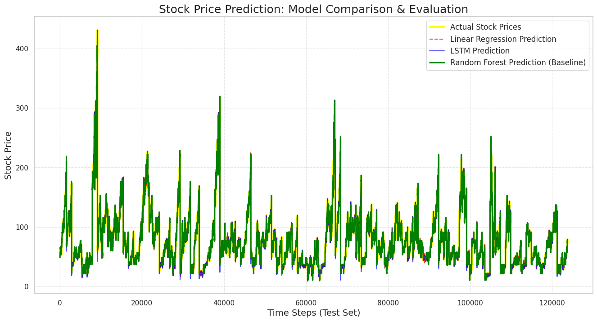

# S&P 500 Stock Price Prediction: Statistical vs. Deep Learning Approaches

## 📌 Project Overview
This project predicts S&P 500 stock prices by comparing three fundamentally different machine learning architectures: **Linear Regression**, **Random Forest**, and a Deep Learning **LSTM (Long Short-Term Memory)** network. The goal is not just to build a model, but to understand how different algorithms behave and fail when forecasting complex financial time-series data.

## 🛠️ Tech Stack
* **Language:** Python
* **Data Manipulation & Preprocessing:** Pandas, NumPy, Scikit-Learn (MinMaxScaler)
* **Machine Learning:** Scikit-Learn (Linear Regression, Random Forest Regressor)
* **Deep Learning:** TensorFlow / Keras (LSTM)
* **Visualization:** Matplotlib

## 📊 Key Insights & Model Evaluation
In financial time-series forecasting, simply looking at metrics can be highly misleading. This project highlights the architectural limitations of different algorithms:

1. **Linear Regression (The Autocorrelation Trap):** Achieved an unrealistically high R-squared score. However, detailed analysis revealed this is largely due to **autocorrelation** and the model's tendency to "echo" the previous day's price (overfitting the trend), rather than possessing true future predictive power.
2. **Random Forest (Extrapolation Failure):** As a tree-based model, it cannot predict values outside the range of its training data. When stock prices hit new highs in the test set, the model plateaued and failed to capture the upward trend.
3. **LSTM:** Handled the sequential nature of the data much better, capturing the momentum and market trends without explicitly memorizing historical data points like the traditional statistical models.

## 🚀 How to Run
1. Clone this repository.
2. Open the `.ipynb` file using Jupyter Notebook or Google Colab.
3. Run the cells sequentially to see the data preprocessing, model training, and the final comparative visualization.
